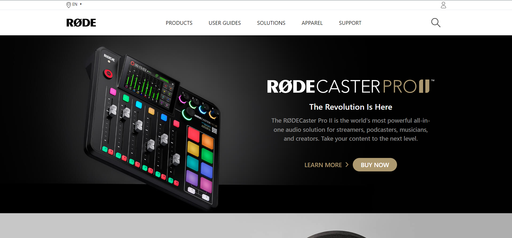

# [Project 16](https://jagadeeshproject16.netlify.app/)

 

# [Rode Clone Website Home Page](https://jagadeeshproject16.netlify.app/)

  

  

>**Learnings from the project**

- How to work with Tailwind css using cdn
- media-queries & responsiveness in tailwind css
- more on flex, flex-properties in tailwind css
- positions, z-index in tailwind css

  

  &nbsp; 

 
